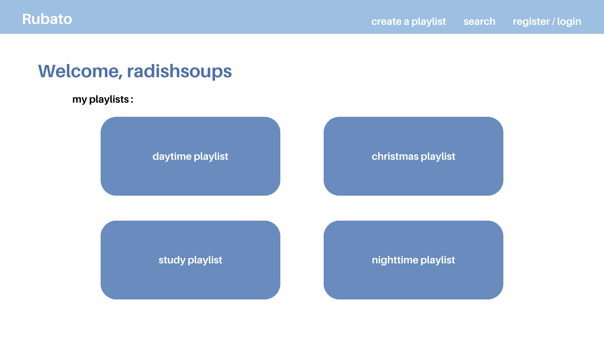
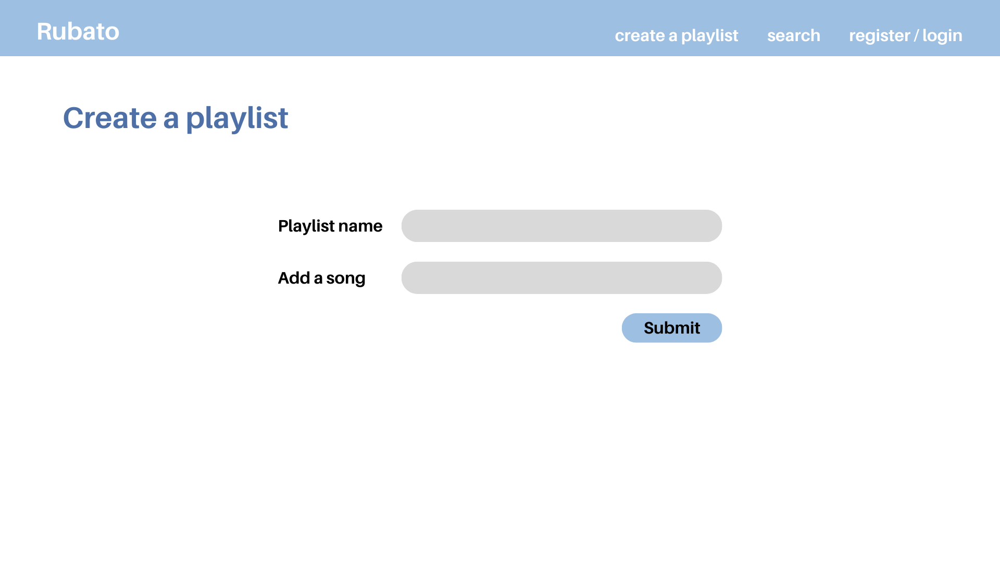
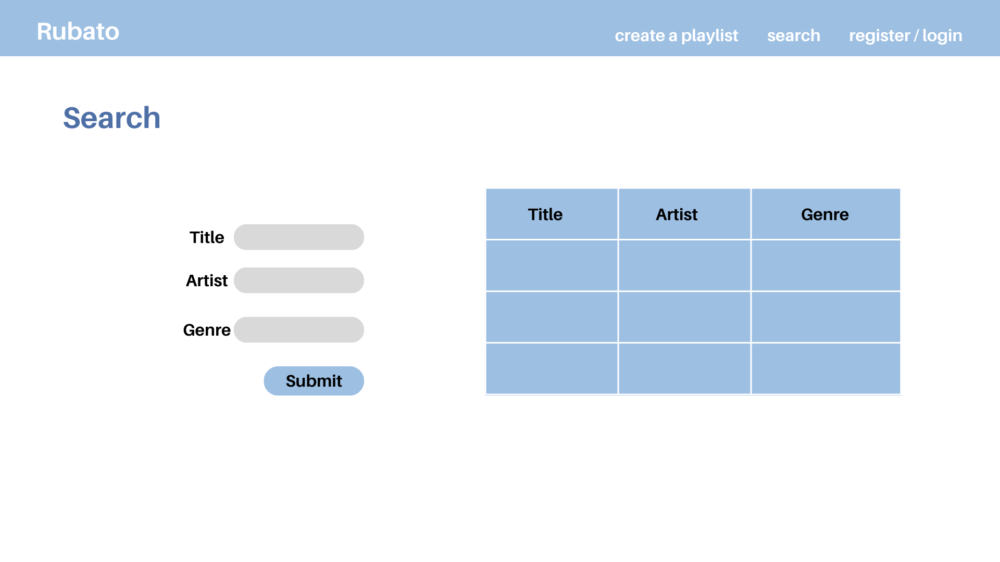
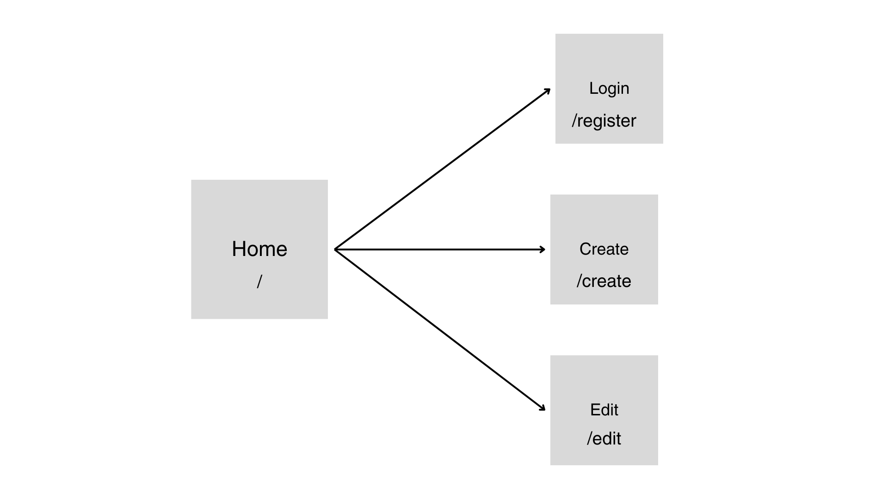

The content below is an example project proposal / requirements document. Replace the text below the lines marked "__TODO__" with details specific to your project. Remove the "TODO" lines.

# Rubato

## Overview

Spotify's Blend playlists lets you share your favorite song with your friends based on your and their music preferences. However, users cannot manually add or remove songs in these playlists, which defeats the purpose of a collaborative playlist and restricts the contents of the playlist to what Spotify wants to add.

Rubato is a web app that will allow users to create playlists and share music with others. Users can register and login, and once they're logged in, they can view the playlists they have shared. In each playlist, they can add or delete songs.


## Data Model

The application will store users, playlists and songs. 

* users can have multiple playlists (via references)
* each list can have multiple songs (by embedding)

An example user:

```javascript
{
  username: "radishsoups",
  hash: // a password hash,
  playlists: // an array of references to List documents
}
```

An example playlist with Embedded songs:

```javascript
{
  user: // a reference to a User object
  name: "Daytime Tracks",
  items: [
    { name: "song1", genre: "lofi", artist: "artist1"},
    { name: "song2", genre: "classical", artist: "artist2"},
  ],
}
```


## [Link to Commented First Draft Schema](db.mjs) 

(__TODO__: create a first draft of your Schemas in db.mjs and link to it)

## Wireframes

/home - landing page that displays all playlists



/create - page for creating a new playlist



/register - page for registration or log in


/search - page for searching based playlists based on title, artist, or genre



## Site map



## User Stories or Use Cases

1. as non-registered user, I can register with a Google account within the site
2. as a user, I can log in to the site
3. as a user, I can create and share a new playlist
4. as a user, I can view all of the playlists I have created 
5. as a user, I can add songs to an existing playlist
6. as a user, I can remove songs from a playlist

## Research Topics

* (5 points) Spotify Web API
    * I'm going to be using Spotify's API to search for songs and artists
    * This will also keep track of genres and potentially be able to search user playlists on Spotify
* (3 points) User Authentication
    * I'm going to use Passport.js for user authentication and login with Google
* (2 points) Hosting on Vercel
    * Connect GitHub account to Vercel in order to host the site (rather than uploading onto NYU's i6 server)

10 points total out of 10 required points


## [Link to Initial Main Project File](app.mjs) 

(__TODO__: create a skeleton Express application with a package.json, app.mjs, views folder, etc. ... and link to your initial app.mjs)

## Annotations / References Used

(__TODO__: list any tutorials/references/etc. that you've based your code off of)

1. [spotify api docs](https://developer.spotify.com/documentation/web-api)
2. [passport.js authentication docs](http://passportjs.org/docs)
3. [vercel hosting docs](https://vercel.com/docs)

